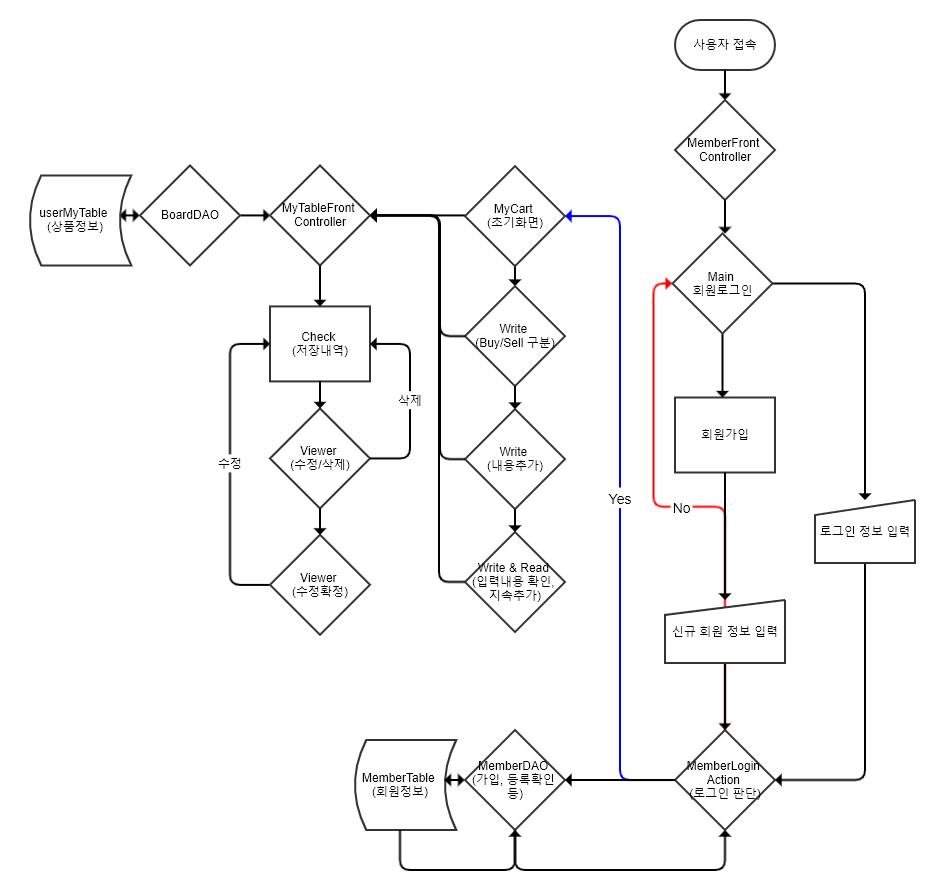

# MyCart
## 서비스 개요
MyCart 는 한정판 프리미엄 패션물품 판매 서비스인 [StockX](https://stockx.com/) 의 UI/UX 개선을 위해 고안된 소비자 맞춤형 장바구니 서비스입니다.

## 기획배경
* StockX UI/UX 이슈
  - 검색 조건 저장 불가
    + 엥겔의 [구매의사결정과정](https://en.wikipedia.org/wiki/Buyer_decision_process) 5단계 中 탐색(2단계) 과정을 저해함
    + 운동화의 경우 선택지가 20개가 되는 필터가 존재하는데도 불구하고 DART 의 검색식 조건 기능이 부재함
    <DART img>
  - 회원당 portfolio 최대 1가지로 생성량 제한 
    + 엥겔의 [구매의사결정과정](https://en.wikipedia.org/wiki/Buyer_decision_process) 5단계 中 대안 평가(3단계) 과정을 저해함
    + 투자자산으로서의 성격을 지닌 재화를 사용자의 시나리오별로 저장할 수 있는 수단이 부재함
* 해결방안
  - 상품정보를 사용자 정의 검색 조건 및 포트폴리오 제목과 같이 저장할 수 있는 기능 제공 
  - &rarr; 저장된 정보를 StockX 서비스 내재화 가능한 방법 모색

## 개발환경
* 운영환경
  - Apache Tomcat 9.0
* 사용기술
  - JAVA8, servlet, model2, HTML5, CSS3, Javascript, jQuery, JDBC(Oracle)
* IDE
  - Eclipse
  
## 개발기간: 10일
* ~12/1(일) : 사전준비 (Meeting 폴더 참조)
  - 주제 선정: 11/28 의견 수렴 후 결정
  - gitHub 강의 수료
  - 업무분담 계획 조율
* 12/3(화)~12/5(목) : 로그인 모듈 구현
* 12/6(금) : 1차 점검
  - 진행현황 점검 및 향후 업무계획 논의
* 12/10(화) ~ 12/11(수): MyCart 모듈 작업
* 12/12(목) : 모듈통합
* 12/13(금) : 시연 및 제출

## 설계 및 기능 소개
<순서도>

## 향후 개선방안
- Oracle 12c&uarr; 혹은 MySQL 5.7.8&uarr; 로 DB환경 변경 &rarr; json 기반 데이터처리로 [DataTable](https://datatables.net/) 과 연동하여 기능 고도화
- StringTokenization 활용한 포트폴리오 및 검색조건란 연계 검색 알고리즘 구축
- 저장한 상품정보에 대한 시각화 정보 제공 (HighChart, d3 등)
